## №1. Установка ОС
1. Узнайте версию Ubuntu, выполнив команду cat /etc/issue.
2. 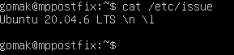
## №2. Создание пользователя
1. Вставьте скриншот вызова команды для создания пользователя.

2. Новый пользователь должен быть в выводе команды 
cat /etc/passwd
3. 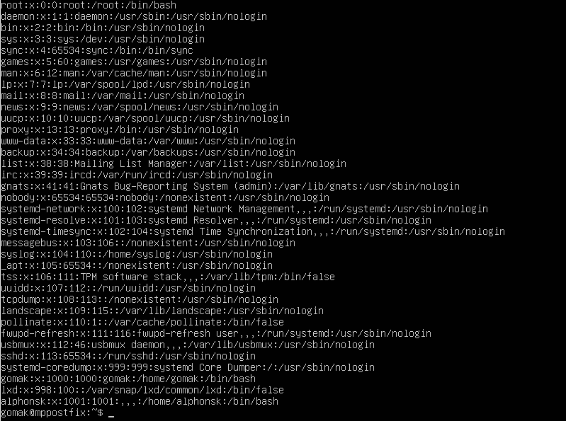
## №3. Настройка сети ОС
1. Задать название машины вида user-1         
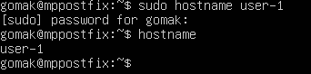               
2. Установить временную зону, соответствующую вашему текущему местоположению        
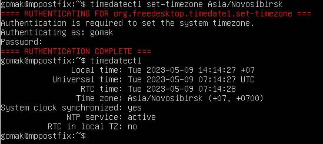
3. Вывести названия сетевых интерфейсов с помощью консольной команды        
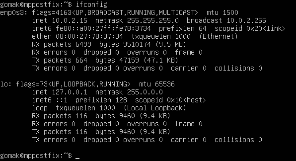
* lo или local loopback (локальная петля). Служит для подключения по сети к этому же компьютеру и не требует дополнительной настройки;
4. Используя консольную команду получить ip адрес устройства, на котором вы работаете, от DHCP сервера.        
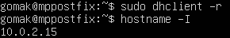
* Dynamic Host Configuration Protocol (DHCP) — автоматический предоставляет IP адреса и прочие настройки сети (маску сети, шлюз и т.п) компьютерам и различным устройствам в сети.
5. Определить и вывести на экран внешний ip-адрес шлюза (ip) и внутренний IP-адрес шлюза, он же ip-адрес по умолчанию (gw).
* внешний ip-адрес шлюза (ip):        

* внутренний IP-адрес шлюза:        

6. Задать статичные (заданные вручную, а не полученные от DHCP сервера) настройки ip, gw, dns (использовать публичный DNS серверы, например 1.1.1.1 или 8.8.8.8).
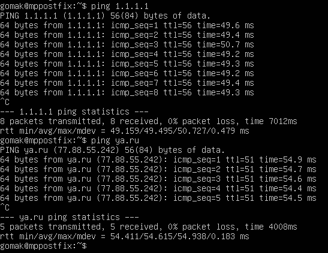         
##  №4.  Обновление ОС
1. Обновить системные пакеты до последней на момент выполнения задания версии
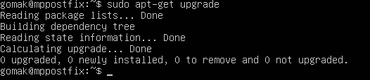
## №5. Использование команды sudo
1. Разрешить пользователю, созданному в Part 2, выполнять команду sudo.  
Sudo — это утилита, предоставляющая привилегии root для выполнения административных операций в соответствии со своими настройками. Она позволяет легко контролировать доступ к важным приложениям в системе. По умолчанию, при установке Ubuntu первому пользователю (тому, который создаётся во время установки) предоставляются полные права на использование sudo. Т.е. фактически первый пользователь обладает той же свободой действий, что и root. 

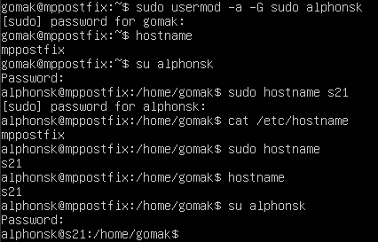
## №6. Установка и настройка службы времени
1. Настроить службу автоматической синхронизации времени.   
Вывод следующей команды должен содержать NTPSynchronized=yes: 
timedatectl show
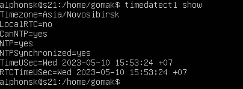
## №7. Установка и использование текстовых редакторов
1. Установить текстовые редакторы VIM (+ любые два по желанию NANO, MCEDIT, JOE и т.д.)   
sudo apt install vim    
sudo apt install nano    
sudo apt install joe
2. Используя каждый из трех выбранных редакторов, создайте файл test_X.txt, где X -- название редактора, в котором создан файл. Напишите в нём свой никнейм, закройте файл с сохранением изменений.
3. Используя каждый из трех выбранных редакторов, откройте файл на редактирование, отредактируйте файл, заменив никнейм на строку "21 School 21", закройте файл без сохранения изменений.
4. Используя каждый из трех выбранных редакторов, отредактируйте файл ещё раз (по аналогии с предыдущим пунктом), а затем освойте функции поиска по содержимому файла (слово) и замены слова на любое другое.
### VIM
1. 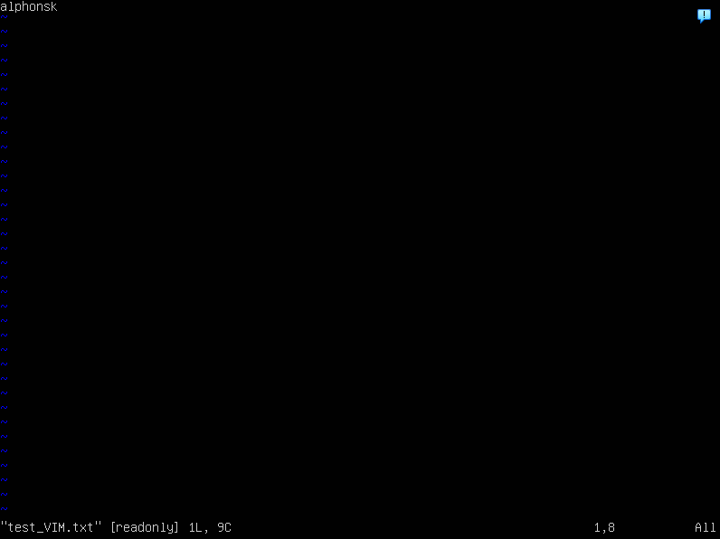
2. )
3. )
4. )
* vim test_VIM.txt   
* Режим редактирования: I   
* Выйти из режима редактирования: esc   
* Выход с охранением: :wq     
* Выход без сохранения: :q        
* Поиск: /<текст, который хотим найти>    
* Замена: :s/<что хотим изменить>/<на что хотим заменить>
### JOE
1. 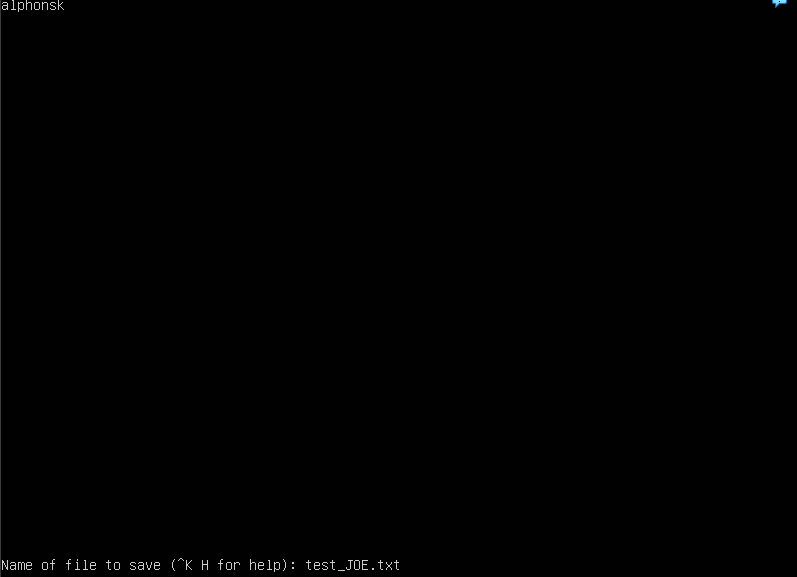)
2. 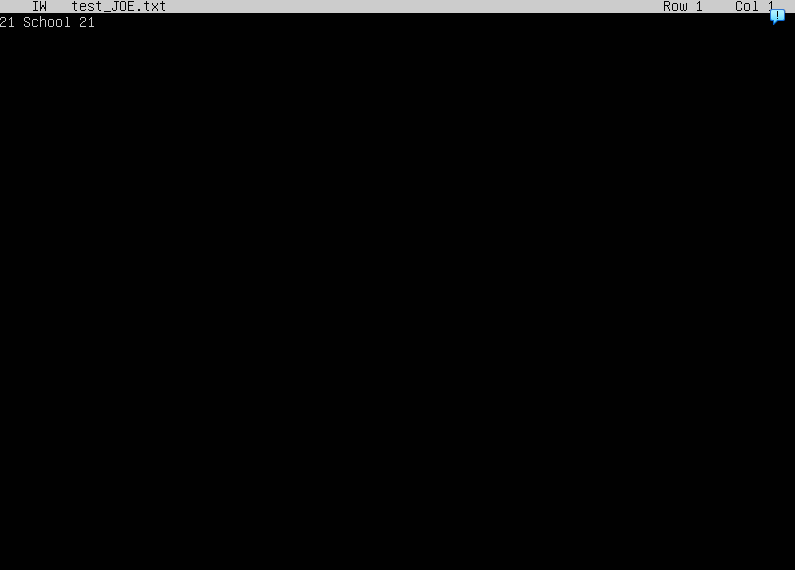)
3. 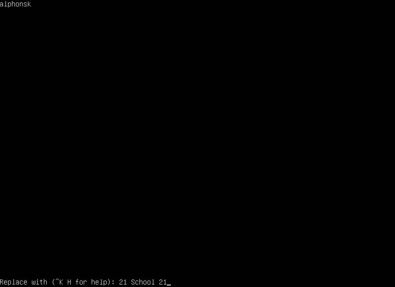)
* joe test_joe.txt       
* Выход с cохранением: CTRL K + X
* Выход без сохранения: CTRL C c запросом на подтверждение     
* Поиск: CTRL K + F 
* Замена: CTRL K + F и затем указать в опциях R
### NANO
1.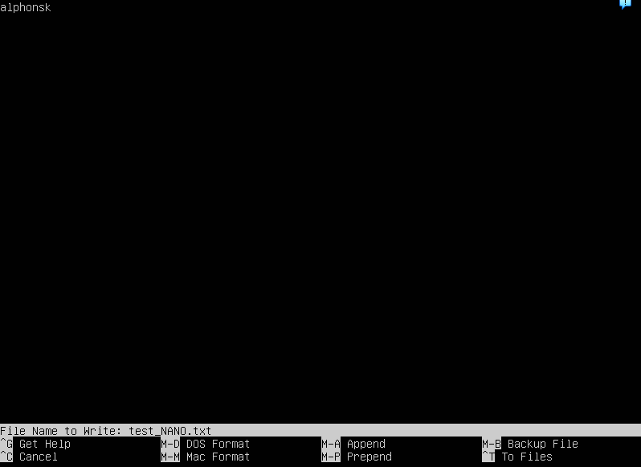)     
2.)      
3.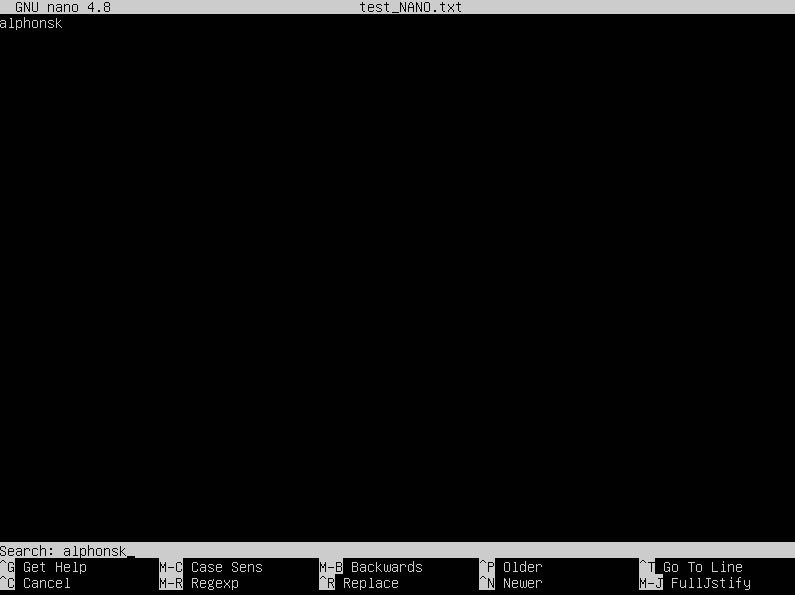)
4.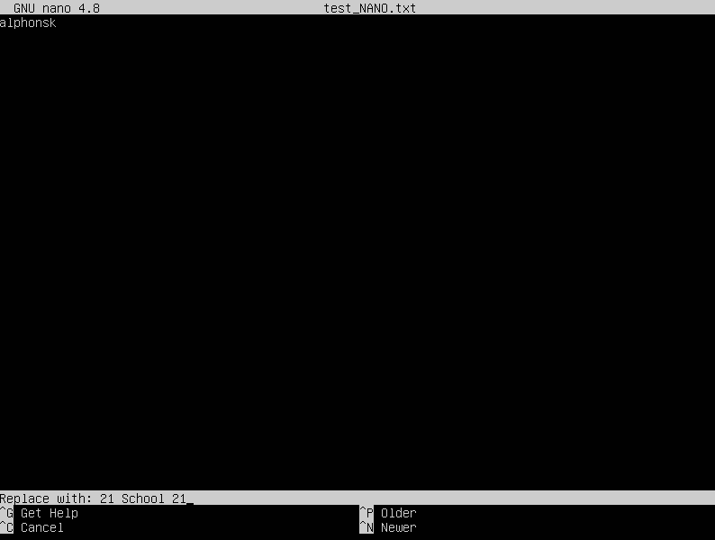)
* nano test_NANO.txt       
* Выход с охранением: CTRL + x, затем y  b enter
* Выход без сохранения: CTRL + x, затем n       
* Поиск: CTRL + W, затем enter (alt + w для перехода к след. вхождению, ctrl + c  для преращения поиска)
* Замена: CTRL + \+ <что хотим изменить + enter> + <на что хотим заменить + enter> + A(для замены все вхождения) или y и n по отдельности
## №8. Установка и базовая настройка сервиса SSHD
1. Установить службу SSHd.
* sudo apt-get install ssh
* sudo apt install openssh-server
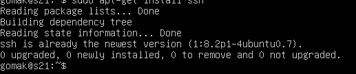
2. Добавить автостарт службы при загрузке системы.
* sudo systemctl enable ssh
* systemctl status ssh
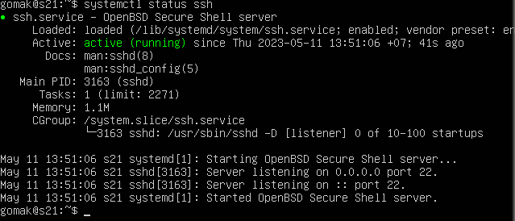)
3. Перенастроить службу SSHd на порт 2022.
* sudo vim /etc/ssh/sshd_config
)
* systemctl restart sshd
4. Используя команду ps, показать наличие процесса sshd. Для этого к команде нужно подобрать ключи.
* ps (показывает запущенные процессы, выполняемые пользователем в окне терминала);
* ps -e или ps -A (Чтобы просмотреть все запущенные процессы);
* ps -d (Чтобы показать все процессы, кроме лидеров сессии);
* ps -d -N (можно инвертировать вывод с помощью переключателя -N. Например, если хочу вывести только лидеров сеансов)
* ps T (увидеть только процессы, связанные с этим терминалом);
* ps r (просмотреть все работающие (running) процессы);
* ps -p 'pid' (если вы знаете идентификатор процесса PID, вы можете просто использовать следующую команду, для вывода процесса с этим 'pid');
* ps -p 'pid1' 'pid2'
* ps U 'userlist' (найти все процессы, выполняемые конкретным пользователем);
* ps -ef (получить полный список);
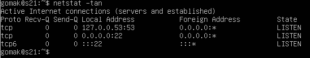
5. Перезагрузить систему
### NETSTAT

* -t (--tcp) отображает соедниеня только по tcp
* -a (--all) вывод всех активных подключений TCP 
* -n (--numeric) вывод активных подключений TCP с отображением адресов и номеров портов в числовом формате
* Proto: Название протокола (протокол TCP или протокол UDP);
* recv-Q: очередь получения сети
* send-Q: Сетевая очередь отправки
* Local Address адрес локального компьтера и используемы номер порта
* Foreign Address адрес и номер удаленного компьтера к которомц подключен сокет
* State состояние сокетв
* 0.0.0.0 означает IP-адрес на локальной машине
## №9. Установка и использование утилит top, htop
### Установить и запустить утилиты top и htop
1. По выводу команды top определить и написать в отчёте:
* uptime - 9:41;
* количество авторизованных пользователей - 1;
* общую загрузку системы - 0.00, 0.00, 0.00
* общее количество процессов - 100;
* загрузку cpu - 0.3%;
* загрузку памяти - 1983.4 total 1054.9 free 220.3 used
* pid процесса занимающего больше всего памяти - 2026 (top -o %MEM);
* pid процесса, занимающего больше всего процессорного времени - 723 (top -o %CPU);
2. В отчёт вставить скрин с выводом команды htop:
* отсортированному по PID, PERCENT_CPU, PERCENT_MEM, TIME
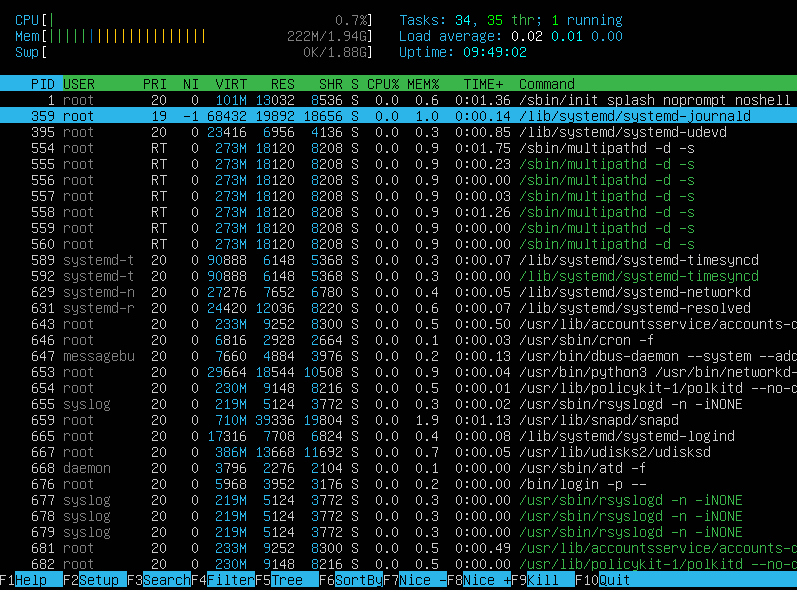)
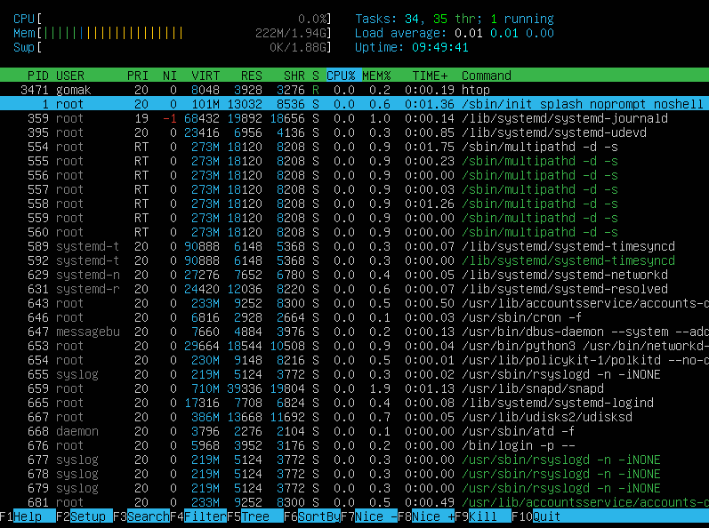
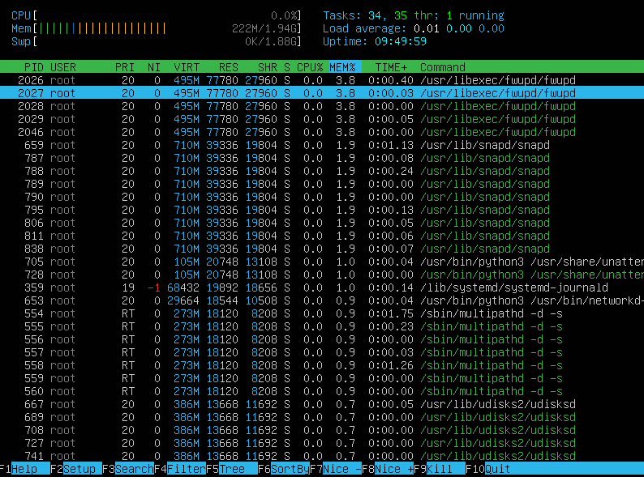
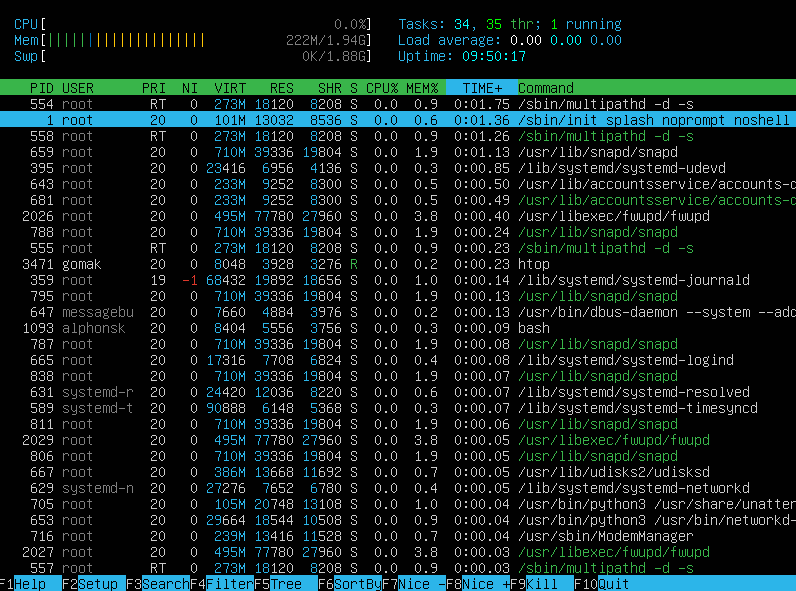
* отфильтрованному для процесса sshd
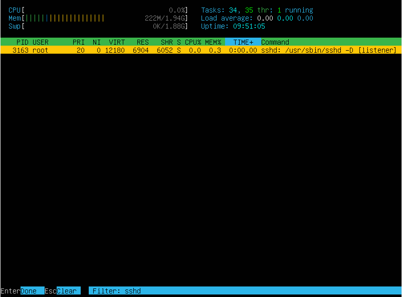
* с процессом syslog, найденным, используя поиск
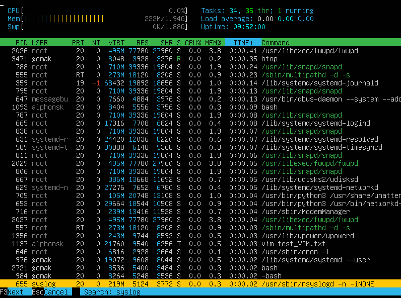
* с добавленным выводом hostname, clock и uptime

## №10. Использование утилиты fdisk
1. Запустить команду fdisk -l.
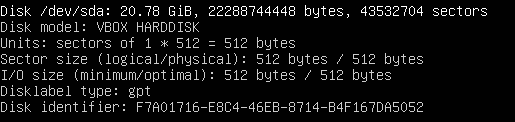
* название жесткого диска - vbox harddisk;
* размер - 20.78 GiB;
* количество секторов - 43532704;
* размер swap - 1,9GiB.

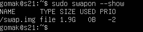
## №11. Использование утилиты df
1. Запустить команду df.
В отчёте написать для корневого раздела (/):
* размер раздела - 10218772;
* размер занятого пространства - 4598408
* размер свободного пространства - 5079692;
* процент использования - 48%;   
Определить и написать в отчёт единицу измерения в выводе - килобайт
2. Запустить команду df -Th.   
В отчёте написать для корневого раздела (/):
* размер раздела - 9.8G;
* размер занятого пространства - 4.4G;
* размер свободного пространства - 4.9G;
* процент использования  - 48%   
Определить и написать в отчёт тип файловой системы для раздела - ext4.
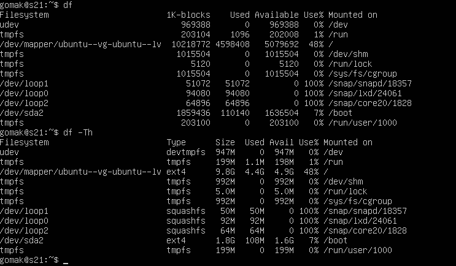
## №12. Использование утилиты du
1. Запустить команду du.
2. * Вывести размер папок /home, /var, /var/log (в байтах)

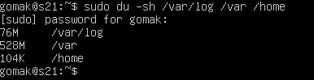
* Вывести размер папок /home, /var, /var/log (в человекочитаемом виде)
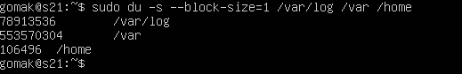
3. Вывести размер всего содержимого в /var/log (не общее, а каждого вложенного элемента, используя *)
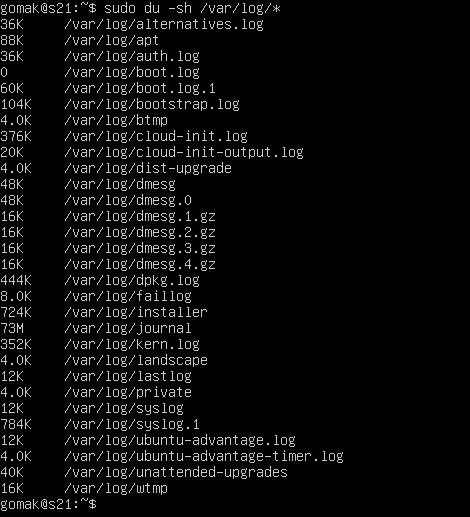
## №13. Установка и использование утилиты ncdu            
1. Установить утилиту ncdu.    
sudo apt-get install ncdu    
Вывести размер папок /home, /var, /var/log.

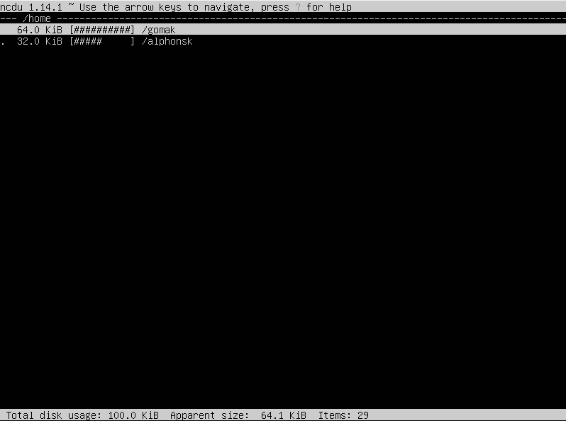

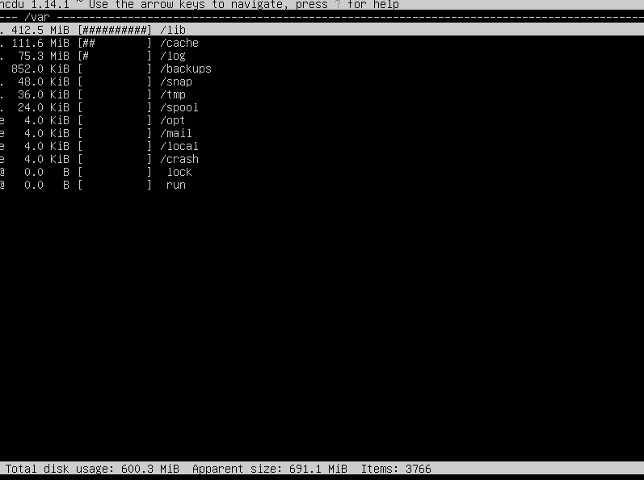
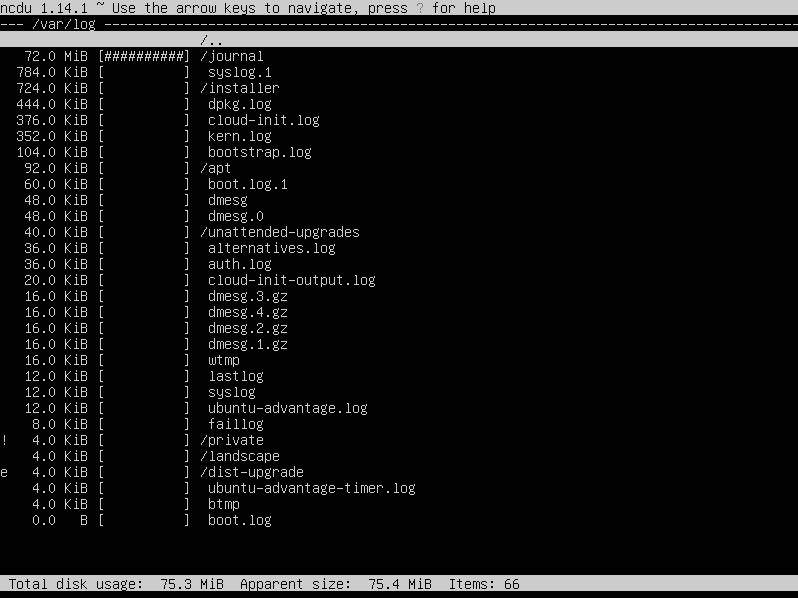
## №14. Работа с системными журналами   
sudo vim /var/log/dmesg     
sudo vim /var/log/syslog          
sudo vim /var/log/auth.log          
1. Написать в отчёте время последней успешной авторизации, имя пользователя и метод входа в систему (06:22:31; gomak by LOGIN)
2. Перезапустить службу SSHd.    
sudo systemctl restart ssh
3. Вставить в отчёт скрин с сообщением о рестарте службы (искать в логах).
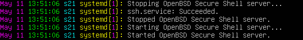
## №15. Использование планировщика заданий CRON
1. Используя планировщик заданий, запустите команду uptime через каждые 2 минуты.
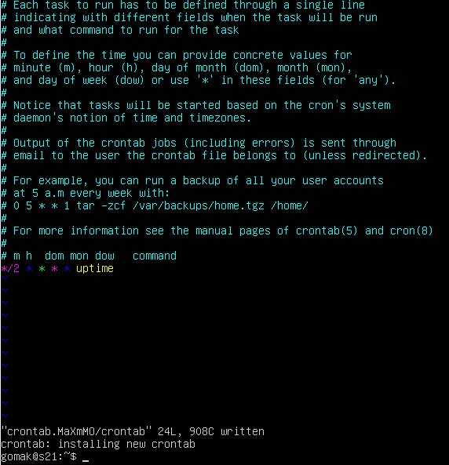
* Найти в системных журналах строчки (минимум две в заданном временном диапазоне) о выполнении.
![](./15/png2.png
* Вывести на экран список текущих заданий для CRON.
* Вставить в отчёт скрины со строчками о выполнении и списком текущих задач
2. Удалите все задания из планировщика заданий.
* В отчёт вставьте скрин со списком текущих заданий для CRON.
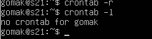